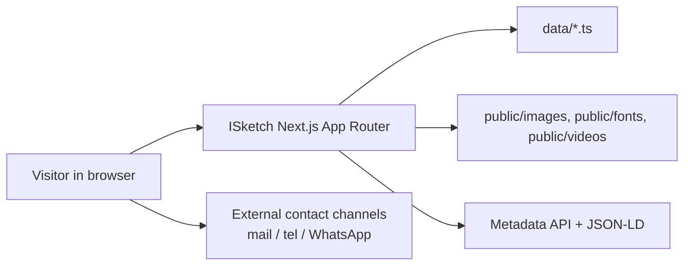
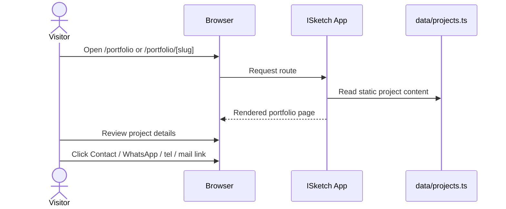
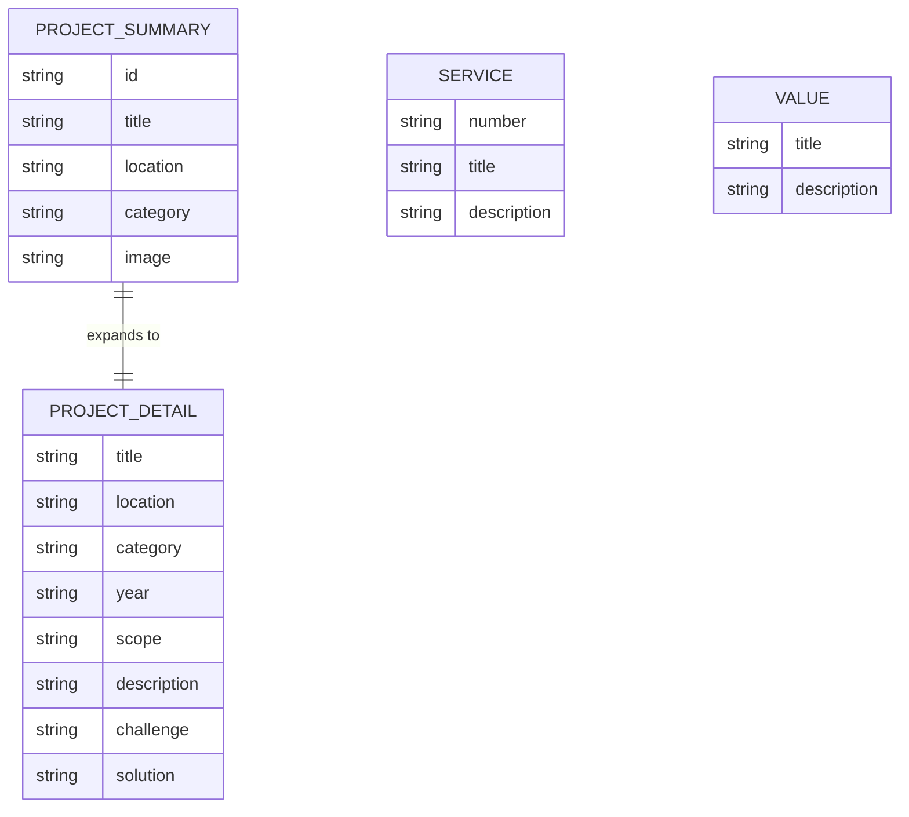

# Architecture

## System Context

ISketch is a static, content-driven Next.js 16 site. There is no backend service, database, CMS, auth layer, or user-generated content flow. The application renders from typed TypeScript content modules and static assets, then ships as a prebuilt marketing site.

## Request Pipeline

1. A visitor requests a public route such as `/`, `/about`, `/services`, `/portfolio`, `/portfolio/[slug]`, `/projects`, or `/contact`.
2. Next.js resolves the App Router page and composes shared layout components.
3. Page components read from `data/*.ts` and `types/index.ts`.
4. The app emits metadata, Open Graph tags, robots directives, sitemap entries, and JSON-LD from the static content.
5. The browser receives static HTML, CSS, and client islands for motion or viewport effects.

## Primary Workflow Sequence

The portfolio detail route is statically generated from `generateStaticParams()` and the project records in `data/projects.ts`.

## Data Model

The actual source of truth lives in `data/projects.ts`, `data/services.ts`, `data/about.ts`, `data/contact.ts`, and `data/legal.ts`.

## Known Limitations

- No CMS or admin editing surface.
- No API routes or persisted data.
- No authentication, payments, file uploads, or queueing.
- Content updates require editing TypeScript data files and rebuilding.

## Evolution Paths

- If editorial updates become frequent, introduce a CMS behind a narrow content adapter.
- If the studio needs lead capture, add a form workflow and a server-side transport layer.
- If multilingual expansion becomes necessary, add locale-aware routing and translated content modules.